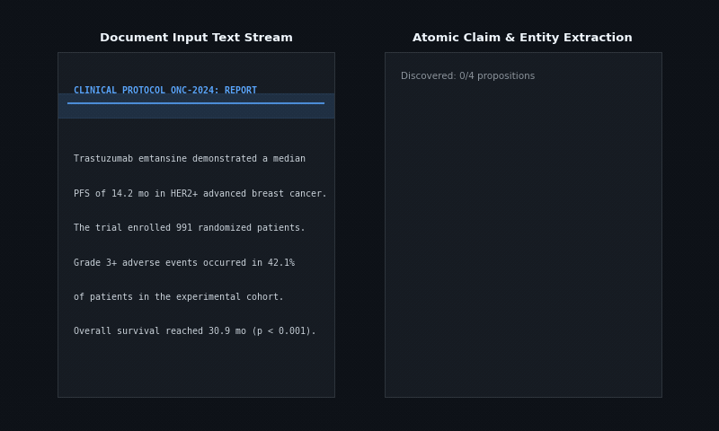
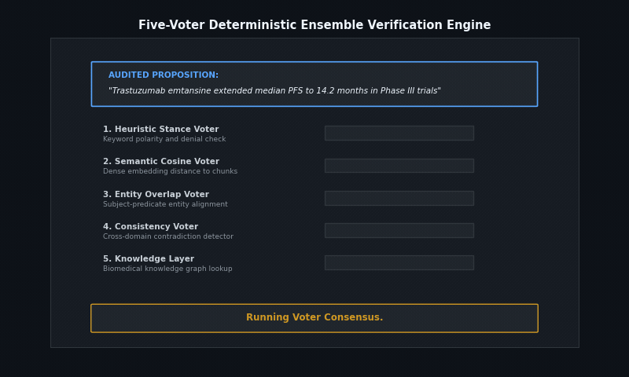
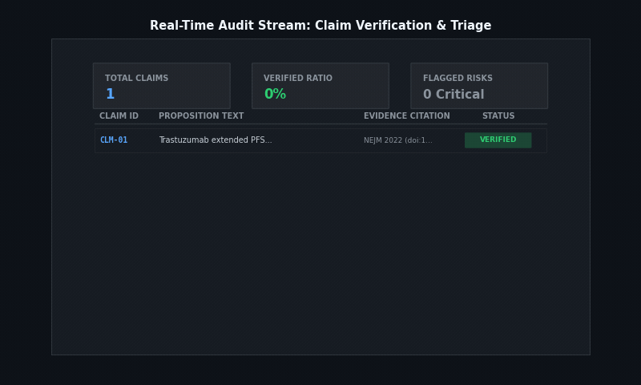

# SAMSA Checker: Document Hallucination Audit System

SAMSA Checker is an open-source, full-stack document hallucination auditing system. It decomposes long-form text documents into atomic factual propositions, executes parallel evidence retrieval across authoritative knowledge bases and the live web, and applies a five-voter deterministic ensemble to classify each claim as `Verified`, `Plausible`, or `Hallucination`.

---

## Technical Demonstrations

### 1. Atomic Claim Extraction and Entity Grounding



The ingest engine parses arbitrary documents (PDF, DOCX, PPTX, or raw text) into isolated propositional units with exact character offset boundaries. It identifies core named entities, numeric bounds, and relational predicates, formatting them into structured evaluation candidates for the downstream verification pipeline.

### 2. Five-Voter Deterministic Ensemble Verification



Each candidate proposition undergoes independent evaluation across five deterministic validation layers: heuristic stance detection, dense semantic embedding similarity, subject-predicate entity overlap, cross-domain consistency verification, and authoritative knowledge graph alignment. The consensus engine dynamically aggregates voter confidences to assign definitive audit verdicts.

### 3. Real-Time Telemetry and Audit Stream Dashboard



Full-stack real-time telemetry streaming via Server-Sent Events (SSE). The dashboard displays claim-by-claim verification progress, source reliability scoring, evidence provenance citations, and critical hallucination flags with audit trail persistence.

---

## System Architecture

```
Halucination_checker/
|-- backend/                             # FastAPI application service
|   |-- services/
|   |   |-- claim_extractor.py          # Proposition segmentation and offset tracking
|   |   |-- retrieval_service.py        # Asynchronous multi-source web retrieval
|   |   |-- trusted_verifier.py         # Authoritative knowledge graph pre-filter
|   |   `-- voters/                     # Five-voter ensemble implementation
|   |       |-- heuristic_voter.py      # Lexical polarity and stance analysis
|   |       |-- semantic_voter.py       # Cosine distance over chunk embeddings
|   |       |-- entity_voter.py         # Named entity and numeric range alignment
|   |       |-- consistency_voter.py    # Contradiction and cross-source checks
|   |       `-- deterministic_voter.py  # Relation-aware rule-based decision logic
|   |-- routers/                        # Endpoints for audit, streaming SSE, and auth
|   `-- sql/                            # Local SQLite schema definitions
|-- frontend/                            # React 18 + Vite + Tailwind interface
|   |-- src/
|   |   |-- components/                 # Claim stream, document viewer, audit panels
|   |   `-- services/                   # EventSource streaming client
|-- docs/
|   `-- gifs/                            # Technical feature demonstration GIFs
|       |-- 01_samsa_atomic_claim_extraction.gif
|       |-- 02_samsa_five_voter_ensemble_verification.gif
|       `-- 03_samsa_realtime_audit_dashboard.gif
|-- data/                               # Cache, logs, and local model artifacts
`-- start.sh                            # Unified local deployment script
```

---

## Deterministic Non-LLM Decision Pipeline

The core audit decision path is strictly deterministic and non-LLM by default. Language models are not used as voters in claim verification to prevent secondary hallucinations.

### Evidence Evaluation Unit

Each retrieved evidence chunk is evaluated as a structured tuple:

- `stance`: `+1 | 0 | -1`
- `relation_match`: `0..1`
- `entity_match`: `0..1`
- `numeric_match`: `0..1`
- `reliability`: `0..1`
- `bias_penalty`: `0..1`

### Contribution and Scoring Formulation

```python
effective_reliability = reliability * (1.0 - bias_penalty)

evidence_strength = (
    stance
    * effective_reliability
    * relation_match
    * (0.5 + 0.5 * entity_match)
    * (0.5 + 0.5 * numeric_match)
)

support = sum(max(0.0, evidence_strength))
refute  = sum(abs(min(0.0, evidence_strength)))

if support + refute == 0:
    label = "Uncertain"
elif support > 2.0 * refute:
    label = "Verified"
elif refute > 2.0 * support:
    label = "Hallucination"
else:
    label = "Conflicting"
```

### Safety and Guardrail Constraints

1. **Direct Evidence Mandate**: Verification requires at least two independent high-reliability sources and `relation_match > 0.7`.
2. **Refutation Priority**: If an authoritative, high-trust domain strongly refutes a claim, the verdict is forced to `Hallucination`.
3. **Missing Evidence Protocol**: If insufficient evidence is discovered, the claim defaults to `Uncertain` rather than a false positive rejection.
4. **Reliability Cutoff**: Evidence sources with reliability scores below `0.3` are discarded.
5. **Bias Penalization**: Commercially sponsored or advocacy-funded domains have their effective weights reduced by 50%.

---

## Quickstart

### 1. Configuration

Copy the example configuration file:

```bash
cp backend/.env.example backend/.env
```

### 2. Single-Command Launch

Launch both the FastAPI backend and Vite frontend via the root startup script:

```bash
./start.sh
```

The script manages port binding, installs missing dependencies, initializes local SQLite databases, and binds the web interface to `http://localhost:5173`.

### 3. Manual Startup

**Backend:**
```bash
cd backend
pip install -r requirements.txt
uvicorn main:app --host 127.0.0.1 --port 8000
```

**Frontend:**
```bash
cd frontend
npm install
npm run dev
```

---

## API Specifications

### Core Audit Endpoints

- `POST /audit`: Execute complete synchronous document audit and return structured JSON
- `POST /audit/stream`: Stream live claim-by-claim verification updates over Server-Sent Events (SSE)
- `POST /audit/probe`: Run targeted diagnostic evaluation on a selected subset of claims
- `POST /documents/readable-text`: Multipart upload endpoint extracting normalized text from PDF, DOCX, and PPTX

### Authentication and History

- `POST /auth/register`: Create local SQLite user account
- `POST /auth/login`: Authenticate and obtain session bearer token
- `GET /history`: List user audit history records
- `GET /history/{history_id}`: Retrieve detailed breakdown for a past audit session

---

## Benchmark Validation

Run the deterministic validation suite covering engineering, medical, and adversarial safety tests:

```bash
cd backend
pytest -q tests/test_deterministic_validation.py
```

Run the automated 6,600-case multi-field benchmark harness:

```bash
python -m tools.benchmark_harness generate --per-field-per-category 100 --holdout-ratio 0.2 --seed 23 --force
python -m tools.benchmark_harness evaluate --split holdout
```

Performance on holdout evaluation:
- Overall accuracy: `0.8902`
- Uncertainty-adjusted accuracy: `0.8297`
- Category false detection rate: `0.9705`

---

## License

This project is licensed under the GNU General Public License v3.0 or later. See the `LICENSE` file for details.
